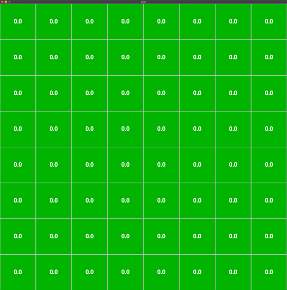

## Gridworld

Visualizing dynamic programming and value iteration on a gridworld



## Usage

Calculate the state values for a random policy using dynamic programming, visualize using pygame

```bash
$ python pygame_grid.py --solver dynamic-programming
```

Find the optimal state values for the grid using value iteration

```bash
$ python pygame_grid.py --solver value-iteration
```

Calculate the state values for a random policy (no pygame visualization)

```python
#  make a 4x4 grid with the goal state at (1, 1)
grid = GridWorld(4, 4, (1, 1))

vi = ValueIteration(
	random_policy, grid
)

state_values = vi.solve()

[[-1.9   -1.    -1.9   -2.71 ]
 [-1.     0.    -1.    -1.9  ]
 [-1.9   -1.    -1.9   -2.71 ]
 [-2.71  -1.9   -2.71  -3.439]]
```

## Dependencies

Python 3.6.5

Main dependencies are `pygame` and `numpy` - test using `pytest`

## pygame on Mojave

I had some issues with `pygame` - below worked for me:

```bash
brew install sdl2 sdl2_gfx sdl2_image sdl2_mixer sdl2_net sdl2_ttf

git clone https://github.com/pygame/pygame.git

cd pygame

python setup.py -config -auto -sdl2

python setup.py install
```
